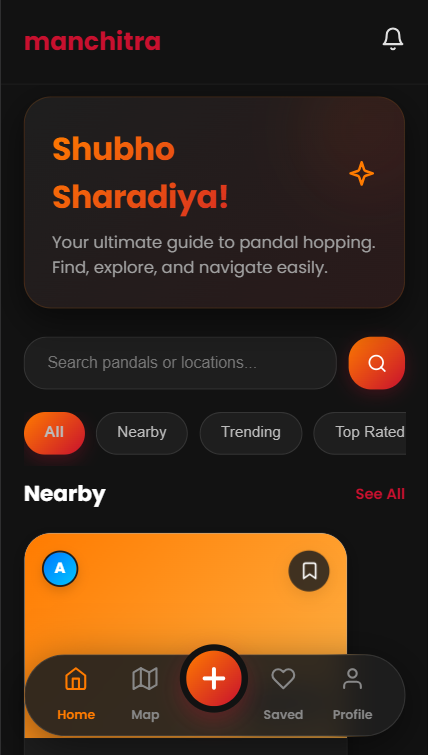
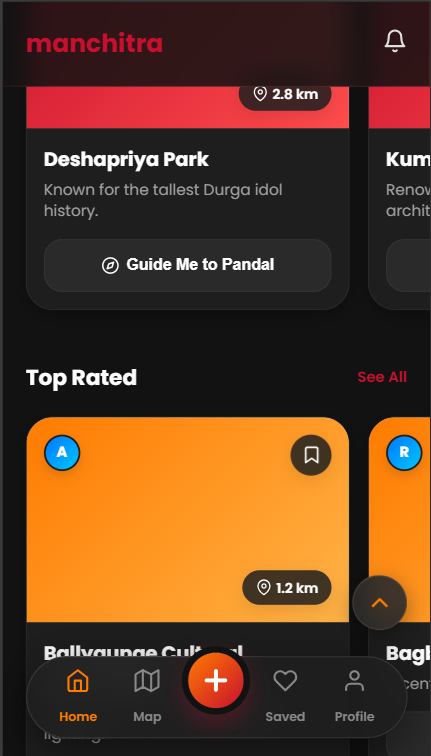
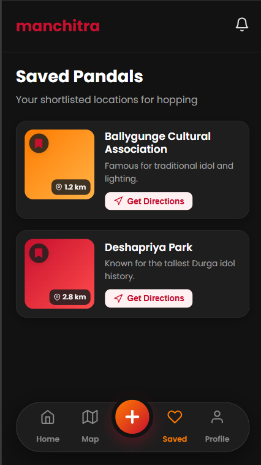
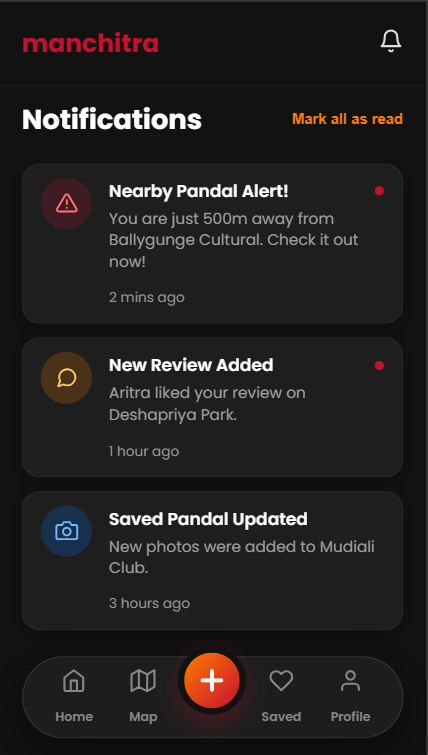
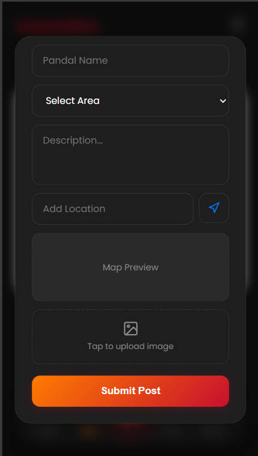

# Manchitra (মানচিত্র) 🗺️

> **Your Ultimate Pandal Hopping Partner**  
> A modern, React-based web application designed to help users navigate, explore, and review Durga Puja pandals seamlessly across Kolkata.

<p align="center">
  
  
  
</p>
<p align="center">
  
  
  
</p>


## ✨ Features

*   **📱 Modern UI/UX:** Built with Glassmorphism, smooth animations, and a clean interface inspired by modern iOS and Android apps.
*   **🌓 Dark Mode Support:** Seamlessly switch between light and dark themes for comfortable nighttime pandal hopping.
*   **📍 Dynamic Categories:** Browse pandals by area (North Kolkata, South Kolkata, etc.) or by categories like **Nearby**, **Trending**, and **Top Rated**.
*   **🔍 Smart Search:** Real-time search to instantly find your favorite pandals or locations.
*   **📌 Save & Bookmark:** Shortlist your favorite pandals and manage them in a dedicated 'Saved' page.
*   **✍️ Post a Pandal:** Discover a hidden gem? Users can post a new pandal with name, description, location (with map preview), and images.
*   **👤 User Profile:** Manage your saved locations, your posts, and access the upcoming **Auto Intelligent AI** feature.
*   **🔔 Notifications:** Stay updated with alerts for nearby pandals, new reviews, and updates with a categorized notification center.
*   **🚀 Performance:** Includes Micro-interactions, Scroll-to-Top functionality, and Skeleton Loading screens for a smooth user experience.

## 🛠️ Tech Stack

*   **Frontend:** React.js, HTML5, CSS3 (Custom scoped styling)
*   **Icons:** Inline scalable SVG vectors
*   **Typography:** Google Fonts (Poppins)

## 🚀 Getting Started

Follow these steps to run the project on your local machine.

### Prerequisites

Make sure you have [Node.js](https://nodejs.org/) and npm installed on your computer.

### Installation

1. **Clone the repository:**
   ```bash
   git clone https://github.com/dbaidya811/manchitra.git
   cd manchitra
   ```

2. **Install dependencies:**
   ```bash
   npm install
   ```

3. **Start the development server:**
   ```bash
   npm start
   ```
   The app will automatically open in your browser at `http://localhost:3000/`.

## 📂 Project Structure

```text
manchitra/
├── public/
│   ├── index.html
│   └── ...
├── src/
│   ├── App.js                 # Main App Component & Landing Page
│   ├── App.css                # Global Styles & Animations
│   ├── Dashboard.js           # Main Home/Dashboard View
│   ├── MapPage.js             # Map & Navigation View
│   ├── SavedPage.js           # Bookmarked Pandals
│   ├── ProfilePage.js         # User Profile & Settings
│   ├── NotificationPage.js    # User Notifications
│   ├── MyPostsPage.js         # User Generated Posts
│   ├── SeeAllPage.js          # Expanded Category View
│   └── index.js               # Entry Point
├── package.json
└── README.md
```

## 🤖 Upcoming Features

*   **Auto Intelligent AI:** An integrated AI assistant to curate personalized pandal hopping routes and suggestions.
*   **Google Maps Integration:** Native map rendering and live route guidance directly within the app.
*   **Backend Integration:** Connect with a Node.js/Firebase backend to support real-time data syncing, user authentication, and photo uploads.

## 🤝 Contributing

Contributions, issues, and feature requests are welcome!  
Feel free to check the issues page if you want to contribute.

1. Fork the Project
2. Create your Feature Branch (`git checkout -b feature/AmazingFeature`)
3. Commit your Changes (`git commit -m 'Add some AmazingFeature'`)
4. Push to the Branch (`git push origin feature/AmazingFeature`)
5. Open a Pull Request

## 📝 License

This project is licensed under the MIT License - see the LICENSE file for details.

---
*Made with ❤️ for the love of Pandal Hopping.*