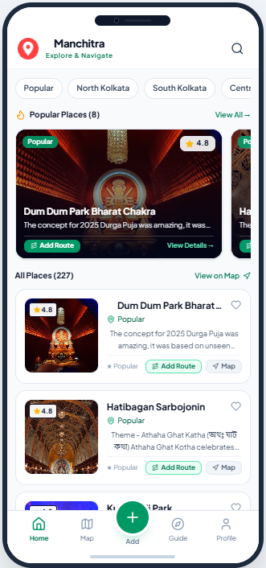
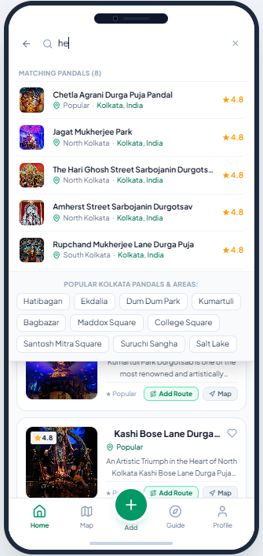
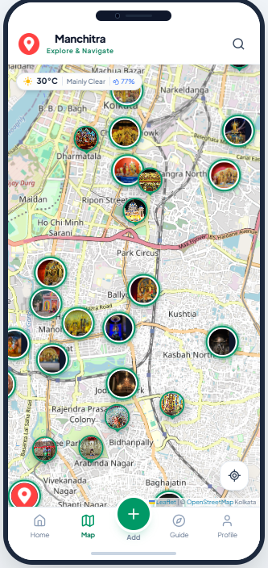
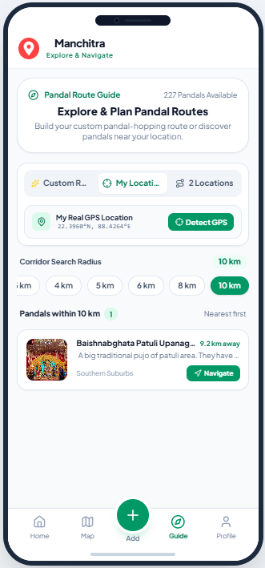
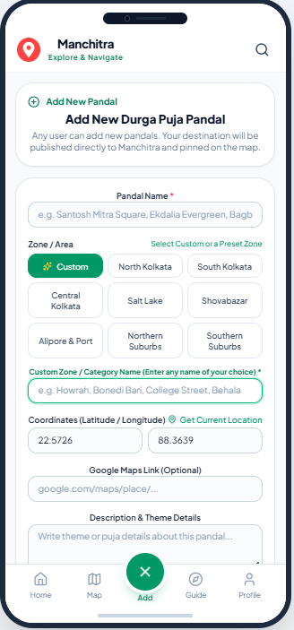
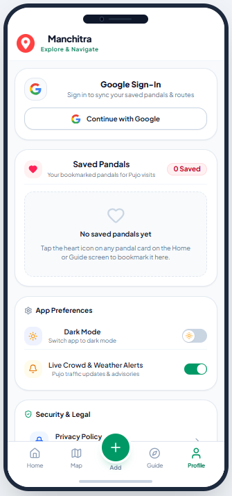

# 🪔 Manchitra (মানচিত্র) — Kolkata Durga Puja Explorer & Live Navigation

<div align="center">


[](https://react.dev/)
[](https://www.typescriptlang.org/)
[](https://vitejs.dev/)
[](https://tailwindcss.com/)
[](https://leafletjs.com/)
[](https://expressjs.com/)
[](https://open-meteo.com/)
[](https://web.dev/progressive-web-apps/)
[](LICENSE)

**The ultimate interactive map, real-time navigation, and live weather companion for Kolkata Sharodotsav (Durga Puja).**

[✨ Features](#-key-features) • [📸 Screenshots](#-app-screenshots) • [🛠️ Tech Stack](#-tech-stack) • [🚀 Getting Started](#-getting-started) • [📡 API](#-api-endpoints)

</div>

---

## 📖 About Manchitra

**Manchitra (মানচিত্র)** is a high-performance web application designed to help millions of revellers, travelers, and puja enthusiasts navigate the grand Durga Puja celebrations in **Kolkata, Howrah, Salt Lake, and surrounding suburbs**.

With over **2,900+ curated and verified pandal locations**, Manchitra combines smooth cluster mapping, turn-by-turn routing, live localized weather forecasts, zone-based itinerary planning, and community crowd-sourced pandal submissions into a fast, mobile-first **Progressive Web App**.

---

## ✨ Key Features

- **🗺️ 2,900+ Clustered Pandals on Interactive Map**
  - High-performance marker clustering powered by Leaflet MarkerCluster.
  - Covers North Kolkata, South Kolkata, Bidhannagar (Salt Lake), Central Kolkata, Behala, Shovabazar and suburban districts.
  - Filter by popularity, awards, heritage, zones, board categories and proximity.

- **🔍 Instant Search & Smart Filters**
  - Instant fuzzy search across all pandals by name, committee, street, landmark or zone.
  - Popular tag shortcuts like *Hatibagan, Kumartuli, Bagbazar, College Square, Ekdalia, Maddox Square* and more.

- **🧭 Real-Time GPS Turn-by-Turn Navigation**
  - In-app walking & driving route calculation with live distance, ETA and step-by-step turns.
  - One-tap external opening in Google Maps for native mobile navigation.
  - Robust Haversine distance engine with automatic "Smart Route" polygon detection.

- **⛅ Live Local Area Weather (Open-Meteo)**
  - Real-time meteorological data for every pandal coordinate — temperature, feels-like, humidity, rain probability & wind speed.
  - Persistent user weather chip with live weather of the user's current GPS location.
  - 100% live data with a 5-minute in-memory cache — zero fake data.

- **🚶 Pandal Hopper & Custom Route Builder**
  - Build custom hopping trails with optimized stop sequences.
  - Add/remove pandals with a single tap from search results, guide or map popups.

- **🧭 Puja Guide & Zone-Wise Itineraries**
  - Curated routes for North Kolkata Heritage, South Kolkata Megastars, Salt Lake Theme trails and crowd advisories.

- **➕ Community Pandal Contributor**
  - Local committees and users can submit new pandals with GPS coordinates, photos and descriptions.
  - Server-side persistence with atomic file storage, backup recovery & validation.

- **📱 Offline PWA & Mobile-First Interface**
  - Installable on Android, iOS and Desktop (Web App Manifest + Service Worker).
  - Dark mode & light mode with high-contrast map themes.

- **🛡️ Secure & Resilient Backend (Express)**
  - OWASP security headers, in-memory sliding-window rate limiting, 6 MB body limits.
  - Sanitized inputs, coordinate validation, atomic JSON persistence with `.bak` auto-recovery.

---

## 📸 App Screenshots

<div align="center">

**🏠 Home** &nbsp;·&nbsp; **🔍 Search** &nbsp;·&nbsp; **🗺️ Map**

<a href="./screenshot/Home_screen.png"></a> <a href="./screenshot/searche_screen.png"></a> <a href="./screenshot/map_screen.png"></a>

**🧭 Guide** &nbsp;·&nbsp; **➕ Add** &nbsp;·&nbsp; **👤 Profile**

<a href="./screenshot/guide_screen.png"></a> <a href="./screenshot/add_screen.png"></a> <a href="./screenshot/proflle_screen.png"></a>

</div>

> 💡 *Click any screenshot to view the full-size version.*

> 💡 All app screens are rendered inside a realistic mobile device frame via `DesktopDeviceWrapper`, so the app looks exactly like the screenshots above on your phone.

---

## 🛠️ Tech Stack

| Layer | Technologies |
| :--- | :--- |
| **Frontend Framework** | [React 19](https://react.dev/) + [TypeScript](https://www.typescriptlang.org/) |
| **Build Tool & Bundler** | [Vite 8](https://vitejs.dev/) with optimized manual chunk splitting (`vendor-react`, `vendor-leaflet`, `vendor-icons`) |
| **Styling & Design** | [Tailwind CSS v4](https://tailwindcss.com/) + [Lucide Icons](https://lucide.dev/) |
| **Maps & Geospatial** | [Leaflet](https://leafletjs.com/), [Leaflet.markercluster](https://github.com/Leaflet/Leaflet.markercluster), [OpenStreetMap](https://www.openstreetmap.org/) |
| **Live Weather Data** | [Open-Meteo API](https://open-meteo.com/) — real-time meteorological telemetry with 5-min caching |
| **Backend Server** | [Express](https://expressjs.com/) (Node.js / tsx runtime) |
| **AI Capabilities** | [Google GenAI](https://ai.google.dev/) (`@google/genai`) |
| **PWA & Offline** | Service Worker (`sw.js`), Web App Manifest, Cache API |
| **Resilience** | React Error Boundary, Atomic File Storage with `.bak` recovery, In-memory Rate Limiting, OWASP Headers |

---

## 🚀 Getting Started

### Prerequisites
- [Node.js](https://nodejs.org/) (v18.0 or later recommended)
- [npm](https://www.npmjs.com/) or [Bun](https://bun.sh/)

### 1. Clone or Download the Repository
```bash
git clone https://github.com/dbaidya811/manchitra.git
cd manchitra
```

### 2. Install Dependencies
```bash
npm install
```
*(Tip: If you ever encounter npm peer dependency issues on older npm versions, use `npm install --legacy-peer-deps`)*

### 3. Configure Environment Variables
Copy `.env.example` to `.env` and fill in your keys:
```bash
GEMINI_API_KEY="YOUR_GEMINI_API_KEY"
APP_URL="http://localhost:3000"
```
> `GEMINI_API_KEY` is required only for Gemini AI features. The rest of the app runs fully offline/local.

### 4. Start Development Server
```bash
npm run dev
```
Open [http://localhost:3000](http://localhost:3000) in your web browser. The Express server automatically boots the Vite dev server in development mode (HMR enabled).

### 5. Automated Deployment (GitHub Actions)
Every time you push code to GitHub (`git push origin main`), the included GitHub Actions workflow (`.github/workflows/deploy.yml`) **automatically builds and deploys** the latest version to GitHub Pages!

**One-Time Setup in your GitHub Repository:**
1. Go to your repo on GitHub -> **Settings** -> **Pages**.
2. Under **Build and deployment** -> **Source**, select **`GitHub Actions`**.
3. That's it! Every future `git push` will deploy automatically without any manual commands.

### 6. Build for Production & Static Hosting
```bash
npm run build
```
The output in `dist/` is a 100% self-contained static Progressive Web App that can be hosted on GitHub Pages, Netlify, Vercel, Firebase Hosting, or any static web server without requiring a Node.js backend.

### 7. Start Local Full-Stack Server (Optional)
```bash
npm start
```
Runs the Express server on port 3000.

---

## 📡 API Endpoints

| Method | Endpoint | Description | Access |
| :--- | :--- | :--- | :--- |
| `GET` | `/api/health` | Service health status, uptime, and timestamp | Public |
| `GET` | `/api/places` | Retrieves all 2,900+ pandals database | Public (Rate-limited) |
| `POST` | `/api/places` | Adds a new pandal with coordinate validation & sanitization | Public (Rate-limited) |
| `POST` | `/api/places/bulk` | Synchronizes / updates full pandals catalog | Admin Token Required |

All endpoints are protected with OWASP security headers, in-memory sliding-window rate limiting, and a 6 MB request body limit.

---

## 📂 Project Structure

```
manchitra/
├── public/                 # PWA assets (manifest.json, sw.js, images, data)
├── screenshot/             # App screenshots & banner used in this README
├── src/
│   ├── components/         # Splash, Home, Search, Map, Guide, Add, Profile screens
│   ├── data/               # places.json (2,900+ pandals) & mockData
│   ├── hooks/              # useDragScroll (touch & drag scrolling)
│   ├── utils/              # geo (Haversine, navigation) & weather (Open-Meteo)
│   ├── App.tsx             # Root application state & routing
│   ├── main.tsx            # React entry point
│   └── types.ts            # Shared TypeScript types
├── server.ts               # Express API server (dev + production)
├── index.html              # Vite entry HTML
├── vite.config.ts          # Vite + Tailwind configuration
└── package.json
```

---

## 📄 License

This project is licensed under the **Apache License 2.0**.

---

<div align="center">
  <sub>Built with ❤️ for Kolkata Durga Puja.</sub><br />
  <sub>🪔 Subho Sharodotsav! আসুন সবাই মিলে প্যান্ডেল দেখি, মানচিত্র ধরে।</sub>
</div>
